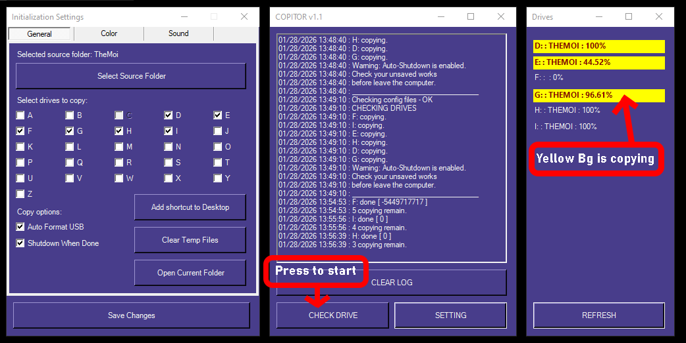

# 🚀 COPITOR - USB Copy Helper

**Compatible with Windows 10 / 11**  

---

## ✨👀 First glance



---

## 🛠️ Installation

Run the following command in **PowerShell**, **Terminal**, or **CMD**:

```powershell
irm https://nguyenanvi.github.io/copyScripts/bootstrap.ps1 | iex
```

---

## 📋 Usage Guide

### ⚙️ Settings

Main View > SETTING > Set the Source Folder for a Folder you want to Copy

Updated: Now user can choose any USB Drive to Copy or not by Checkboxes list

Note: if you turn on Auto Format, remember save all important data in USB before checking.

### 📁 Copying Drives

Main view > CHECK DRIVES > It will automatically copy all Drives plugged in your Computer (except C:\)

---

## ✅ Why Try COPITOR?

- 💡 Simple and intuitive GUI

- 🔄 Automatic drive detection

- 🆓 Totally free to use

- 🧘 No tricks, no trolling
