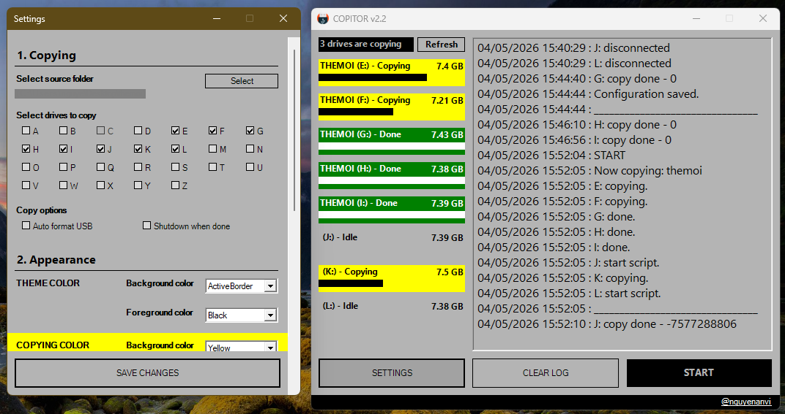

# COPITOR

"USB Copy Helper"

### ✨👀 First glance



### Features:
- You can now choose any USB drive to copy using a **checkbox list**.
- Recent update - **Auto Copy When Plugged In**: Automatically starts copying when a new storage device (selected in the checkbox list) is connected. Now you can just open this app, then plug your devices and!
- Customize your view by modifying the theme.
- Auto create shortcut on Desktop.
- Localization: English, Vietnamese


## Installation

Run the following command in **PowerShell**, **Terminal**, or **CMD**:

```powershell
irm https://nguyenanvi.github.io/copyScripts/install.ps1 | iex
```

---

## Usage Guide

### ⚙️ SETTINGS

**Main View** > ```SETTINGs``` > Set the ```Source Folder``` for a Folder you want to Copy

_Note: if you turn on **Auto Format** and **Auto Copy When Plugged In**, remember save all important data in USB before checking, **all data will be erased**._

### 📁 START

In the Main view, press ```START```. Your selected folder will be copied automatically to all chosen drives (except C:\).

---

### 🔍 Troubleshoot

On some computers, the script may not run at first. Please run this command in the terminal (as Administrator): 
```powershell
Set-ExecutionPolicy -ExecutionPolicy RemoteSigned
```
_If you find any bugs or have suggestions for this script, please
[Contact Us](mailto:nguyenanvi122333@gmail.com?subject=AboutCOPITORv2u3)_

> ## Feel free to use!